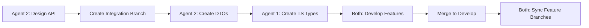

# Git Coordination Workflow for Multi-Agent Development

## Problem Statement

In multi-agent development, agents working on separate feature branches cannot see each other's:
- API contracts and TypeScript interfaces
- Updated documentation
- Coordination files
- Cross-cutting changes

This guide establishes workflows to ensure proper visibility and coordination.

## Branch Strategy Overview

```
main (production-ready)
  └── develop (integration branch)
       ├── feature/properties-ui (Agent 1)
       ├── feature/backend-properties-api (Agent 2)
       └── integration/properties-contracts (shared work)
```

## Critical Shared Resources

### Always-Current Files
These files should ALWAYS be current across all branches:
- `/docs/**/*.md` - All documentation
- `CLAUDE.md` - Master coordination file
- `.claude/**/*` - Session management system
- `/frontend/src/types/**/*.ts` - Shared TypeScript interfaces
- `/frontend/src/api/**/*.ts` - API client contracts

### Coordination Points
Files that require special handling:
- API contracts between frontend/backend
- Shared TypeScript type definitions
- Database migration coordination
- Feature documentation updates

## Workflow Solutions

### Solution 1: Frequent Develop Syncs (Recommended)

Agents should sync with develop branch frequently:

```bash
# Daily sync pattern for all agents
git checkout feature/your-branch
git fetch origin
git merge origin/develop
# Resolve any conflicts
git push origin feature/your-branch
```

**Benefits**:
- See other agents' merged work
- Documentation stays current
- Early conflict detection

### Solution 2: Integration Branches for API Contracts

For API work requiring frontend/backend coordination:

```bash
# Create integration branch from develop
git checkout develop
git pull origin develop
git checkout -b integration/properties-api-contracts

# Both agents work on this branch for contracts
# Agent 2 creates DTOs
# Agent 1 creates TypeScript interfaces

# Merge back to develop when contracts are stable
git checkout develop
git merge integration/properties-api-contracts
git push origin develop

# Both agents then merge develop into their feature branches
```

### Solution 3: Cross-Branch Cherry-Picking

For urgent coordination needs:

```bash
# Agent 1 needs specific commit from Agent 2
git fetch origin
git cherry-pick <commit-hash>
```

## Recommended Daily Workflow

### Morning Sync (All Agents)
```bash
# 1. Update your feature branch with latest develop
git checkout feature/your-branch
git fetch origin
git merge origin/develop

# 2. Check for coordination updates
ls -la docs/development/
cat docs/tracking/completion-log.md
```

### Before Creating API Contracts
```bash
# 1. Create integration branch
git checkout -b integration/module-api-contracts

# 2. Create contracts
# - Backend: Create DTOs in /backend/src/PlatformERM.Application/DTOs/
# - Frontend: Create types in /frontend/src/types/

# 3. Push integration branch
git push origin integration/module-api-contracts

# 4. Notify other agent via GitHub issue
```

### End of Day
```bash
# 1. Push your work
git push origin feature/your-branch

# 2. If you updated shared resources, merge to develop
git checkout develop
git pull origin develop
git merge feature/your-branch
git push origin develop
```

## Documentation Update Protocol

### When Updating Core Docs
1. Make changes on your feature branch
2. Immediately create PR to develop
3. Tag as "documentation" for fast review
4. Merge quickly to make available

### Priority Documentation
These should be merged to develop ASAP:
- Agent role updates
- Coordination protocols
- API documentation
- Feature relationships

## API Contract Coordination

### The Integration Branch Pattern

When Agent 1 and Agent 2 need to coordinate on API:

1. **Agent 2** creates integration branch:
   ```bash
   git checkout -b integration/properties-api
   ```

2. **Agent 2** creates backend DTOs:
   ```csharp
   // backend/src/PlatformERM.Application/DTOs/Properties/PropertyDto.cs
   public class PropertyDto
   {
       public int Id { get; set; }
       public string Name { get; set; }
       // ... etc
   }
   ```

3. **Agent 2** pushes and notifies Agent 1

4. **Agent 1** checks out integration branch:
   ```bash
   git checkout integration/properties-api
   ```

5. **Agent 1** creates matching TypeScript:
   ```typescript
   // frontend/src/types/property.types.ts
   export interface PropertyDto {
       id: number;
       name: string;
       // ... matching backend
   }
   ```

6. Both agents can now see contracts and develop against them

7. Merge integration branch to develop when stable

### API Development Sequence



## Common Scenarios

### Scenario 1: Agent 1 Needs Updated Backend API

```bash
# Agent 1 workflow
git fetch origin
git checkout origin/feature/backend-api-update -- backend/src/
# Or merge the specific branch
git merge origin/feature/backend-api-update
```

### Scenario 2: Documentation Out of Sync

```bash
# Quick fix - merge latest develop
git merge origin/develop
# This brings in all documentation updates
```

### Scenario 3: Urgent Cross-Agent Update

1. Create hotfix branch from develop
2. Make critical update
3. Merge to develop immediately
4. All agents pull develop

## Best Practices

### DO:
- ✅ Sync with develop daily
- ✅ Use integration branches for API contracts
- ✅ Merge documentation updates quickly
- ✅ Communicate via GitHub issues
- ✅ Keep feature branches small and focused

### DON'T:
- ❌ Work in isolation for days
- ❌ Create API contracts without coordination
- ❌ Hold documentation updates in feature branches
- ❌ Ignore merge conflicts
- ❌ Bypass the integration branch pattern

## Emergency Procedures

### When Branches Diverge Too Much

```bash
# Nuclear option - rebase on develop
git checkout feature/your-branch
git fetch origin
git rebase origin/develop
# Carefully resolve conflicts
git push --force-with-lease origin feature/your-branch
```

### When Coordination Breaks Down

1. Stop all work
2. All agents sync to develop
3. Create integration branch
4. Resolve conflicts together
5. Merge to develop
6. All agents branch fresh from develop

## Summary

The key to multi-agent Git coordination:
1. **Frequent syncs** with develop branch
2. **Integration branches** for shared work
3. **Quick merges** for documentation
4. **Clear communication** via GitHub issues
5. **Disciplined workflow** following these patterns

This ensures all agents can see each other's work and coordinate effectively.